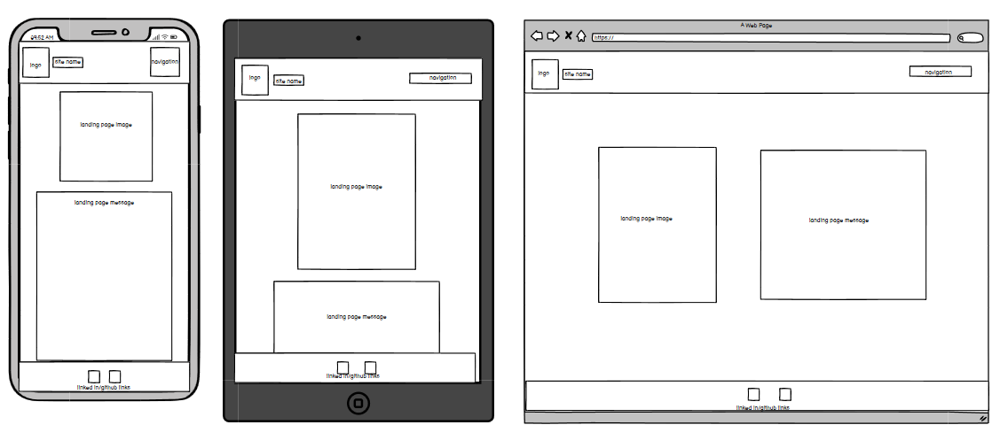

# MyPortfolio
<!-- A link (URL) to your published portfolio website -->
https://jasonblu123.netlify.app/

<!-- A link to your GitHub repo -->
https://github.com/jasonblu123/MyPortfolio

<!-- A link to your presentation video -->
https://www.youtube.com/watch?v=yXQl7uQ_UZY

<!-- Description of your portfolio website, including,
Website Purpose--->
To provide detailing information about me, Express my personality and experiences and showcase my web development coding skills to attract potential clients and employers.

<!-- Functionality / features -->
Navigation panel with icon home button, picture/text animation, scroll to top feature,
contact me message feature, linked in/github/resume links,
links to blogs

<!-- Sitemap -->
[Sitemap](src/sitemap/sitemap%20page.png)

<!-- Screenshots -->

[Alt text](src/wireframes/wireframe%20real.png)

<!-- Target audience -->
Potential clients and employers

<!-- Tech stack (e.g. html, css, deployment platform, etc) -->
html, css, netlify, wirify, balsamic iq, iphone simulator

<!-- DOCUMENTATION -->
Reference List

Animation (no date) Mozilla.org. Available at: https://developer.mozilla.org/en-US/docs/Web/CSS/animation (Accessed: June 2, 2023).

Css animation is stretched out (no date) Stack Overflow. Available at: https://stackoverflow.com/questions/69957813/css-animation-is-stretched-out (Accessed: June 2, 2023).

How to change link color when clicked? (no date) Stack Overflow. Available at: https://stackoverflow.com/questions/17479912/ (Accessed: June 2, 2023).

How to create a blog layout (no date) W3schools.com. Available at: https://www.w3schools.com/howto/howto_css_blog_layout.asp (Accessed: June 2, 2023).

HTML CSS exercise: Practice and solution (no date) w3resource. Available at: https://www.w3resource.com/html-css-exercise/ (Accessed: June 2, 2023).

Stuntz, A. (2018) Ridiculously easy row and column layouts with Flexbox, DEV Community. Available at: https://dev.to/drews256/ridiculously-easy-row-and-column-layouts-with-flexbox-1k01 (Accessed: June 2, 2023).

W3Schools free online web tutorials (no date) W3schools.com. Available at: https://www.w3schools.com/default.asp (Accessed: June 2, 2023).

(No date). Available at: http://html-css-practical-exercises/html-css-practical-exercise-15.php (Accessed: June 2, 2023).
